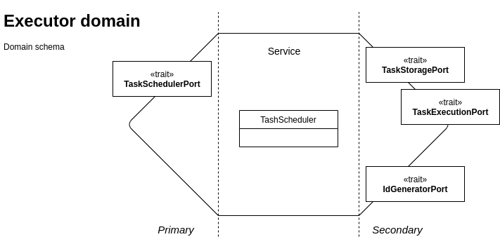
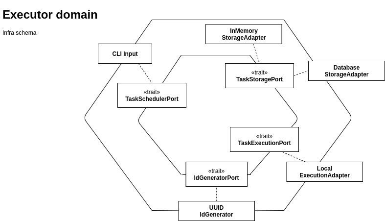

# Blueprint hexagonal architecture in Rust

:wave: This project goal is to provide a blueprint of an implementation of hexagonal architecture in Rust.  
:warning: This project is in a work in progress mode and will be updated when I will find the time (and the courage) to work on it

This project is a tiny task scheduler, you can create some tasks that will be run and get their status.

## Hexagonal architecture

For hexagonal architecture presentation please refer to [Alistair Cockburn presentation](https://alistair.cockburn.us/hexagonal-architecture/)

_This project:_  
Domain & Infra code are split in two projects.  
I know it is not perfect and it could be improved (and it will be) but there is all the basics of hexagonal architecture from my point of view :
 - Separation of domain logic and infrastructure (side-effects) code
 - Portable domain
 - Testable domain
 - Composition in infra code to execute as wanted
 - Each secondary.adapter have a proper model for its purpose

### Domain
 

_Ports_ :  
- __TaskSchedulePort (_executor::ports::primary::TaskSchedulerPort_)__ : Contract to schedule some Task and get their status
- __TaskStoragePort (_executor::ports::secondary::TaskStoragePort_)__ : Contract to store tasks and their executions
- __TaskExecutionPort (_executor::ports::secondary::TaskExecutionPort_)__ : Contract for task execution
- __IdGeneratorPort (_executor::ports::secondary::IdGeneratorPort_)__ : Contract to generate ids for tasks


### Infra
 

_Adapters_ :  
- __CLI Input (_primary::cli::CliOpt_)__ : Input of the application via command line
- __UUID IdGenerator (_secondary::adapter::id_generator::UUIDGeneratorAdapter_)__ : Ig generator based on UUID
- __Local ExecutionAdapter (_secondary::adapter::execution::LocalExecutionAdapter_)__ : Task execution secondary.adapter on local machine
- __Database StorageAdapter (_secondary::adapter::storage::database::SqliteStorageAdapter_)__ : Database storage
- __InMemory StorageAdapter (_secondary::adapter::storage::memory::InMemoryStorageAdapter_)__ : InMemory storage

### Composability

Storage can be in memory using `secondary::adapter::storage::memory::InMemoryStorageAdapter` or with sqlitedb using `secondary::adapter::storage::database::SqliteStorageAdapter`.
This behavior is configured by the `new_storage_adapter` in `secondary::adapter::storage` module.  
Currently, the choice is hard coded but it could be configurable.

## Setup

### Database init (Optional)

Application roll automatically database migration but you can manualy do the needed migrations.

To initialize database please install [`cargo install diesel_cli for sqlite`](https://github.com/diesel-rs/diesel/tree/master/diesel_cli#installation).

Run the migrations at root of the project: `diesel migration run --database-url <database_path>`

### Build

Use cargo for build : `cargo build`

### Configuration

The configuration of the application is loaded from [settings.toml](settings.toml) file.

You can override configuration by env var (example `export DATABASE_URL=override.db` override `database.url` settings)

### Execute

_Run from `cargo` :_ `cargo run -- <args>`

_Command line execution :_ ` ./target/debug/blueprint-hexagonal-infra <args>`

### Usage

__Run a task__ :
```
blueprint-hexagonal-infra-run 0.1.0

USAGE:
    blueprint-hexagonal-infra run [FLAGS] [OPTIONS] <command>...

FLAGS:
    -w, --wait       Wait the execution of the task and print status

OPTIONS:
    -n, --name <name>    Name of the task for later querying

ARGS:
    <command>...    Command to be executed by the task

```

_Example_ :   `./target/debug/blueprint-hexagonal-infra run ls /`

__Status of a task__ :
```
USAGE:
    blueprint-hexagonal-infra status id <id>
    blueprint-hexagonal-infra status name <name>
```

_Example_ :   `./target/debug/blueprint-hexagonal-infra status id f340a3d3-f5ca-42b1-9a3b-312112836cd8`

### Database connection

```
 sqlite3 test.db
SQLite version 3.31.1 2020-01-27 19:55:54
Enter ".help" for usage hints.
sqlite> select * from tasks;
1477bb1b-73b2-468e-a4e2-fc571423da25||ls /home||SUCCESS|fteychene
linuxbrew
```

## TODO

 - [x] Improve genericity for the domain using `Into` and `From` (limitation on secondary ports see [#limitations](#into-for-secondary-ports))
 - [x] Add unit tests
 - [x] Add real life secondary.adapter
 - [x] CLI Adapter for input
 - [x] Improve error management
 - [x] Improve documentation
 - [x] Run migration through code for database
 - [ ] Add input validation
 - [ ] Split task execution
 - [ ] Split code to client and server
 - [ ] Make connection through unix socket from cli to server
 
## Limitations

### Into for secondary ports 

[Concerned code part](domain/src/executor/ports/secondary.rs#L11)

__Goal__ :
Main goal was to provide a way for adapters to not adapt their internal domains to application domain as function result.  
To provide this feature we would like to provide functions of secondary ports to return types with only `Into<DomainStruct>` constraint.

__Issue__ :
```
error[E0038]: the trait `std::convert::Into` cannot be made into an object
  --> infra/src/main.rs:37:1
   |
37 | fn test() -> Box<dyn Into<u8>> {
   | ^^^^^^^^^^^^^^^^^^^^^^^^^^^^^^ the trait `std::convert::Into` cannot be made into an object
   |
   = note: the trait cannot require that `Self : Sized`

error: aborting due to previous error
```

The trait `Into` cannot be used as part of a dynamic type due to [error E0038](https://doc.rust-lang.org/error-index.html#E0038)